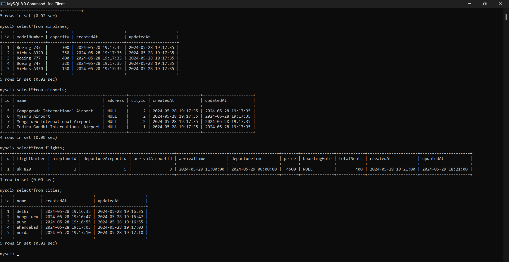

it incorporates a Microservice MVC architecture, which guarantees both scalability and availability of the system.

Microservice based Flight Booking System
april 2024 - june 2024
• Designed and developed a robust Flight Booking System based on a Microservices architecture.
• Implemented four microservices: Flight Service, Booking Service, Authentication Service, and Notification
Service, each serving a specific function with robust error handling and Idempotent APIs.
• Leveraged MySQL database with Sequelize ORM, harnessing transaction capabilities for ensuring database
consistency.
• Implemented a secure JWT based authentication service which works as API Gateway for other services
incorporating Reverse proxy setup and Rate limited system.
• Improved communication efficiency between Notification and Booking Service using RabbitMQ.